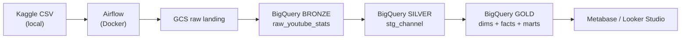
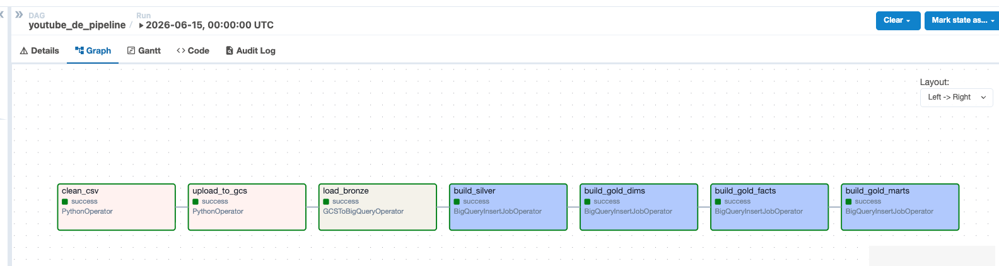

# YouTube Stats ELT to BigQuery

Small ELT project: pull the Kaggle "Global YouTube Statistics 2023" CSV,
land it in GCS, load it into BigQuery, and build a Bronze → Silver → Gold
dimensional model with country, category, and per-channel marts.

Originally targeted AWS (Redshift + EMR + S3); reworked onto GCP because
BigQuery's free tier is generous enough to run this forever at zero cost.

## Stack

- Python 3.11 — pandas for cleaning
- Apache Airflow 2.9 — Docker, LocalExecutor on Postgres metadata
- Google Cloud — GCS for raw landing, BigQuery for the warehouse
- Terraform — provisions the bucket and BigQuery datasets
- Metabase — optional BI on `localhost:3000`

## Architecture



## Warehouse layers

- **BRONZE** — `bronze.raw_youtube_stats`, day-partitioned on `load_date`
- **SILVER** — `silver.stg_channel` (typed, deduped, NULL handling)
- **GOLD dims** — `dim_country`, `dim_category`, `dim_channel`
- **GOLD fact** — `fact_channel_metrics` (subs, views, uploads, earnings ranges, derived ratios)
- **GOLD marts** — `mart_top_channels_by_country`, `mart_country_performance`, `mart_category_performance`

Silver and Gold use `CREATE OR REPLACE TABLE ... AS SELECT`, so reruns
are safe and idempotent on the snapshot data.

## Setup

1. **GCP** — create the project, enable APIs, create a service account,
   download the key, run Terraform. Step-by-step in
   [`docs/gcp_setup.md`](docs/gcp_setup.md).

2. **Local env**:

   ```bash
   cp .env.example .env
   ```

   Fill in `GCP_PROJECT_ID`, `GCS_LANDING_BUCKET`, and the absolute path
   to the service account JSON.

3. **Kaggle CSV** — already in `data/Global YouTube Statistics.csv`.
   If you want a fresh pull, drop the CSV in `data/` with the same name.

4. **Start Airflow**:

   ```bash
   make up
   ```

   First boot pulls the Airflow image and builds the custom one with
   `apache-airflow-providers-google` — give it a few minutes.

5. Open <http://localhost:8080> (admin / admin), enable
   `youtube_de_pipeline`, trigger it.

## DAG



```
clean_csv → upload_to_gcs → load_bronze → build_silver
                                              └→ build_gold_dims
                                                    └→ build_gold_facts
                                                          └→ build_gold_marts
```

## Sample queries

Top 10 channels per country:

```sql
SELECT country, country_rank, channel_name, category, subscribers, video_views
FROM `yt-de-project.gold.mart_top_channels_by_country`
WHERE country IN ('United States', 'India', 'Brazil')
ORDER BY country, country_rank;
```

Country performance, ranked by subscribers per capita:

```sql
SELECT country, channel_count, total_subscribers,
       ROUND(subscribers_per_capita, 4) AS subs_per_capita
FROM `yt-de-project.gold.mart_country_performance`
WHERE population IS NOT NULL
ORDER BY subscribers_per_capita DESC NULLS LAST
LIMIT 20;
```

Categories ranked by average views per upload:

```sql
SELECT category, channel_count,
       ROUND(avg_views_per_upload, 0) AS avg_views_per_upload
FROM `yt-de-project.gold.mart_category_performance`
ORDER BY avg_views_per_upload DESC NULLS LAST;
```

## Notes / gotchas

- **Airflow + SQLAlchemy 2.x don't mix.** The image pins `SQLAlchemy<2.0`
  for that reason. If you bump providers, check the resolved version.
- **Free tier reality.** This project's data is ~270 KB. You can rerun
  the DAG hundreds of times a month and not register on the BigQuery
  bill. If you scale it, partition pruning matters — that's why the
  bronze table is day-partitioned even though we only load one snapshot.
- **`load_date` patch step.** `GCSToBigQueryOperator` autodetect doesn't
  add the partition column itself, so the DAG runs an `UPDATE` right
  after the load. Cleaner alternative: build the table with an explicit
  schema and stamp `load_date` in pandas before upload. Left as a TODO.
- **One service account.** It has `bigquery.admin` and `storage.admin`
  scoped to the project. For real production, split into per-task SAs
  and tighten to `bigquery.dataEditor` / `storage.objectAdmin`.

## Roadmap

- [ ] Split SQL into dbt models on top of `silver.stg_channel`
- [ ] Pull the Kaggle CSV inside the DAG instead of relying on the
      checked-in copy
- [ ] Add a Looker Studio dashboard reading from the gold marts
- [ ] Switch to incremental `MERGE` once there's >1 snapshot
- [ ] Pytest suite for the SQL (sqlglot or dbt-osmosis style checks)

## History

This repo started as an AWS pipeline (Redshift + Spectrum + EMR +
Airflow on EC2). The git log up to mid-2024 reflects that. Cost and
complexity didn't match the size of the dataset, so it was reworked
onto GCP/BigQuery in 2026.
