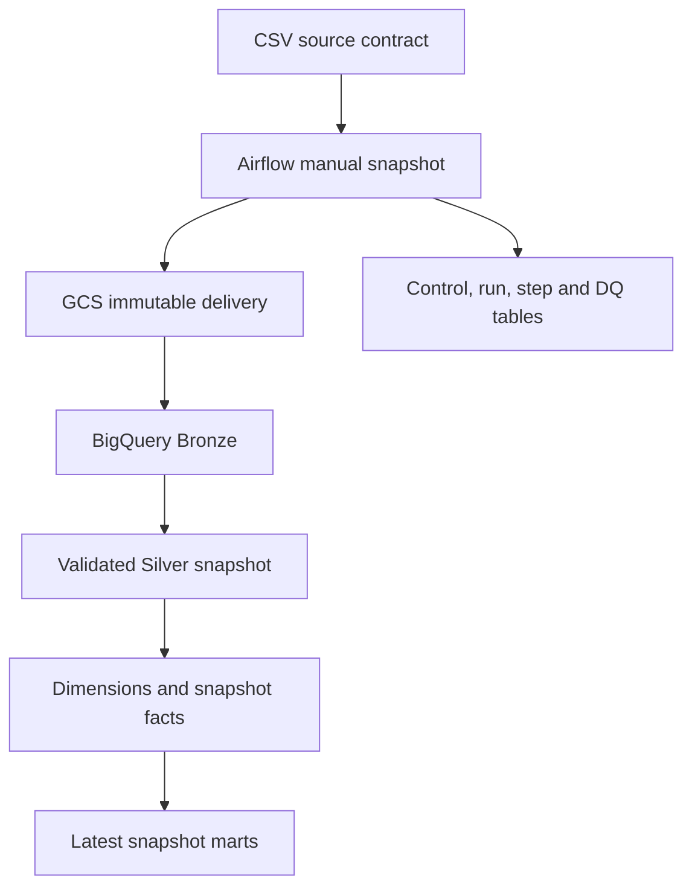

# YouTube snapshot data platform

A portfolio ELT implementation using production data engineering patterns: explicit source contracts, retained deliveries, audited runs, recoverable snapshot processing and scoped access. The business problem is comparing channel metrics by country and content category without double-counting repeated source deliveries.

The checked-in Kaggle Global YouTube Statistics 2023 extract is static public data. This is not a live YouTube feed, an employer system or a production-proven deployment. Its 995 rows have no immutable channel ID or embedded observation date. Operators must supply the source observation date. Processing the same extract under invented dates does not establish real history.

## Architecture

```mermaid
flowchart TD
    Source["CSV source contract"] --> Airflow["Airflow manual snapshot"]
    Airflow --> Landing["GCS immutable delivery"]
    Landing --> Bronze["BigQuery Bronze"]
    Bronze --> Silver["Validated Silver snapshot"]
    Silver --> Gold["Dimensions and snapshot facts"]
    Gold --> Marts["Latest snapshot marts"]
    Airflow --> Ops["Control, run, step and DQ tables"]
```

## Engineering behavior

| Concern | Implemented behavior |
| :--- | :--- |
| History | Content addressed source objects; date/checksum delivery deduplication in Bronze; retained Silver/fact date partitions |
| Grain | One normalized channel name per snapshot date; provisional key limitation is explicit |
| Incremental processing | Selected Silver/fact partition replaced atomically; dimensions MERGE; latest marts refreshed |
| Control | One ops control row supplies active state, source path, source name and supported routing at runtime |
| Auditing | Run and step status, timestamps, attempts, source checksum/count, layer counts, job ID, available job bytes/DML counts |
| Quality | Strict schema/count contract, duplicates and numeric rejects, row-loss assertions, fact relationship assertions |
| Recovery | Same date/checksum replay; changed delivery requires explicit correction flag |
| Access | Ingestion and transformation service accounts; scoped dataset grants; analyst read access; separate deployment privileges |
| Masking | Separate synthetic contacts table with authorized masked view; no real PII |
| Cost | Date filters, partitioned snapshots, clustered keys and per-query bytes cap; no benchmark claims |
| CI | Python lint/format/tests, SQLFluff BigQuery parse/lint, configuration checks, narrow secret-pattern checks, Terraform checks and real DAG import in Docker |

## Local setup

Use Python 3.11, Docker Compose, Terraform >=1.6 and a personal GCP project with billing. Cloud execution has costs; no zero-cost guarantee. Create a fresh DEV project before migrating an existing deployment.

1. Read [deployment.md](docs/deployment.md) and [rbac.md](docs/rbac.md).
2. Provision Terraform using an uncommitted environment variable file and isolated state.
3. Authenticate with `gcloud auth application-default login`. Set `.env` from `.env.example`, including the ADC file path.
4. Install development tools with `python -m pip install -r requirements-dev.txt`; run `make check`.
5. Install `google-cloud-bigquery` to run the administrator bootstrap. Export `GCP_PROJECT_ID` and `BQ_LOCATION`; run `make bootstrap`.
6. Start Airflow with `make up`. Open http://localhost:8080 with local-only admin/admin credentials. Keep this service bound to a trusted machine; do not expose this development stack publicly.
7. Trigger explicitly: `make trigger SNAPSHOT_DATE=2023-08-01`. This is an example date; substitute the actual source observation date.

The Docker image pins Airflow and provider versions using the matching constraints file. Routine tasks use ADC and optionally impersonate the two Terraform-created runtime identities. Unset impersonation variables select development mode, whose effective permissions are those of the ADC principal.

## Repository

`dags/` holds orchestration and runtime adapters. `contracts/` contains the CSV contract. `sql/bigquery/` contains administrator initialization and layer SQL; `sql/operations/` answers operational questions. `terraform/` contains one reusable environment configuration. `tests/` contains local tests and a real Airflow import test. `docs/` records architecture, grain, security, operations and decisions.

## Validation and tradeoffs

Offline checks cannot establish cloud SQL behavior or IAM enforcement. Follow [deployment smoke checks](docs/deployment.md) before claiming cloud execution works. SCD2 is intentionally omitted: this source cannot support trustworthy channel identity across renames. Historical facts preserve country/category, while channel display attributes are Type 1. Control is deliberately bounded to one source; descriptive retention and schedule fields do not enforce deletion or scheduling. No dbt, streaming stack, generic onboarding engine or additional cloud is introduced.

Earlier AWS implementation remains in git history; obsolete AWS DAG code was removed. The existing screenshot at `docs/images/dag-output.png` depicts the previous DAG and is not evidence for this upgrade.
