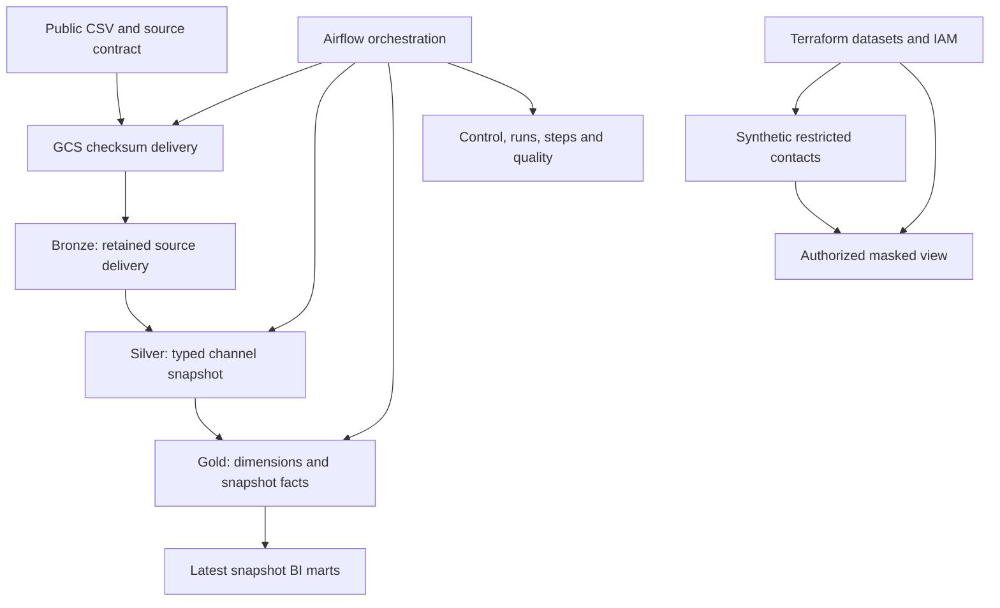
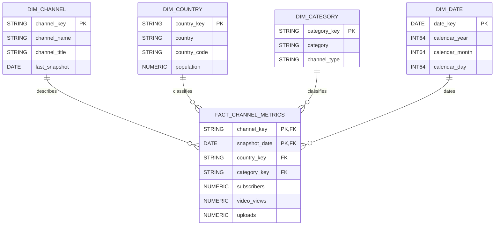

# Complete project plan and implementation map

## Delivery scope

Deliver a complete, inspectable GCP data engineering reference project. The current deliverable is the repository: architecture, defined warehouse model, transformation SQL, masking rules, IAM configuration, operational framework, tests and documentation. GCP account setup and live deployment are outside this delivery. No cloud setup is required to inspect the design or run the credential-free checks.

Repository complete means that each core design has an implementation artifact and an explanation. It does not mean that resources were provisioned, masking was enforced on live data, or the end-to-end cloud pipeline was executed. The implementation remains on GCP; there is no local DuckDB architecture substitution.

## Platform design

| Layer | Responsibility | Defined objects | Processing and history |
| :--- | :--- | :--- | :--- |
| Landing | Preserve original source bytes | GCS raw/youtube/date/checksum/source.csv and normalized.ndjson | Conditional create; retain checksum deliveries |
| Bronze | Retain accepted source deliveries and ingestion lineage | bronze.raw_youtube_stats | Explicit source strings; append once per date/checksum; date partition |
| Silver | Standardize and type source entities | silver.stg_channel | One normalized channel name per date; replace selected partition atomically |
| Gold | Provide analytical relationships and measurements | dim_channel, dim_country, dim_category, dim_date, fact_channel_metrics | Dimension MERGE; snapshot fact partition replacement |
| Presentation | Expose current analytical summaries | mart_top_channels_by_country, mart_country_performance, mart_category_performance | Full refresh over latest available fact snapshot |
| Operations | Control and explain execution | pipeline_control, pipeline_run, pipeline_step_run, pipeline_snapshot, data_quality_result, rejected_record | Runtime configuration, audit, current published checksum and reject evidence |
| Security demonstration | Show restricted values and masked consumer access | security_demo.synthetic_contacts, masked_demo.masked_contacts | Fake data only; authorized view and scoped access definitions |

## Dimensional model

The fact grain is one channel per source snapshot date. Channel identity is SHA256 of the trimmed, lowercased source name; a rename is not automatically reconciled. This is a documented source limitation, not an immutable YouTube ID.

Diagram keys are logical model constraints. BigQuery primary/foreign key declarations are not installed as enforced constraints; SQL quality assertions check fact relationships. Channel and country attributes use Type 1 updates, guarded so an older backfill cannot replace newer attributes. Category is an insert-only dictionary. Facts preserve their own country/category classifications. SCD Type 2 is intentionally omitted until real stable source IDs and observed attribute changes can support a trustworthy timeline.

Model SQL: [dimensions](../sql/bigquery/gold_dims.sql), [facts](../sql/bigquery/gold_facts.sql), [marts](../sql/bigquery/gold_marts.sql). Full grain and field groups: [data_model.md](data_model.md).

## Masking and RBAC

Synthetic Security Demonstration is implemented as Terraform resource definitions, a synthetic seed SQL script, an authorized view and analyst grants. It is separate from the public YouTube model.

| Field | Restricted synthetic value | Defined analyst output |
| :--- | :--- | :--- |
| channel_key | synthetic-channel-1 | synthetic-channel-1 |
| contact_name | Example Contact | REDACTED |
| contact_email | mustafa@example.com | m********@example.com |
| contact_phone | +1-202-555-0100 | REDACTED |

These are illustrative values from the seed and view expressions, not output from a deployed warehouse. Analysts receive viewer access to Gold and masked_demo. They receive no security_demo base-table grant. The individual masked view is authorized to read its source. Ingestion and transformation identities have separate scoped permissions. The common Airflow process can impersonate both identities; worker isolation is not claimed.

Definitions: [Terraform IAM and view](../terraform/main.tf), [fake contact seed](../sql/bigquery/security_demo.sql), [security.md](security.md), [rbac.md](rbac.md).

## Completed delivery phases

| Phase | Delivered outcome | Evidence | Repository status |
| :--- | :--- | :--- | :--- |
| 1. Inspect and clean | Existing GCP preserved; legacy AWS DAG and committed OS files removed | Git history; [original assessment](upgrade_plan.md) | Complete |
| 2. Control and audit | Runtime control, run/step lifecycle and published snapshot pointer | [bootstrap SQL](../sql/bigquery/bootstrap.sql); [runtime](../dags/utils/runtime.py) | Complete |
| 3. Snapshot history | Checksum landing, delivery replay protection and selected Silver partition replacement | [runtime](../dags/utils/runtime.py); [Silver SQL](../sql/bigquery/silver_stg_channel.sql) | Complete |
| 4. Dimensional model | Four dimensions, snapshot fact, stable canonical keys and latest marts | [data_model.md](data_model.md); [Gold SQL](../sql/bigquery/gold_dims.sql) | Complete |
| 5. Data quality | Source contract, persisted rejects, hard assertions and warning records | [contract](../contracts/youtube.json); [quality design](data_quality.md) | Complete |
| 6. Access and masking | Scoped identities and separate synthetic authorized masked view | [Terraform](../terraform/main.tf); [security.md](security.md) | Complete |
| 7. Environments | Reusable Terraform with DEV/PROD examples and ADC development setup | [environment examples](../terraform/environments); [.env example](../.env.example) | Complete |
| 8. Code quality | Tests, lint/format, SQL/configuration validation and real Airflow import CI | [tests](../tests); [CI](../.github/workflows/validate.yml) | Complete |
| 9. Operations | Monitoring queries, failure recovery, corrections and backfills | [monitoring SQL](../sql/operations/monitoring.sql); [runbook](runbook.md) | Complete |
| 10. Presentation | README, architecture/model/security docs, ADRs and this implementation map | [README](../README.md); [ADRs](adr); [walkthrough](project_walkthrough.md) | Complete |

## Original requirement coverage

| Requirement | Implementation or explicit decision | Evidence |
| :--- | :--- | :--- |
| 1. Repository inspection | Recorded initial state and dependencies before upgrade | [upgrade_plan.md](upgrade_plan.md) |
| 2. Existing architecture | Airflow, GCS, BigQuery and Terraform retained | [architecture.md](architecture.md) |
| 3. Medallion layers | Bronze provenance, typed Silver and dimensional Gold | [layer SQL](../sql/bigquery) |
| 4. Metadata control | One supported runtime control row; descriptive schedule/retention fields | [bootstrap](../sql/bigquery/bootstrap.sql); [operations](operations.md) |
| 5. Process runs | Run/step states, timestamps, attempts, counts, jobs and errors | [runtime](../dags/utils/runtime.py) |
| 6. Reruns and backfills | Stable delivery identity; selected date only; explicit correction approval | [runbook](runbook.md); [fact transaction](../sql/bigquery/gold_facts.sql) |
| 7. Dimensional model | Snapshot grain; four dimensions; Type 1 rationale and logical relationships | [data_model.md](data_model.md) |
| 8. Incremental processing | Date-scoped replacement and dimension MERGE; economical full mart refresh | [Silver](../sql/bigquery/silver_stg_channel.sql); [Gold](../sql/bigquery/gold_dims.sql) |
| 9. Data quality | Schema, required keys, duplicates, numbers, counts and FK assertions | [quality design](data_quality.md); [source validator](../dags/utils/utils.py) |
| 10. Masking | Fake contacts; restricted base table; authorized masked view | [security](security.md); [Terraform](../terraform/main.tf) |
| 11. RBAC | Ingestion, transformation, analyst and platform administrator personas | [rbac.md](rbac.md) |
| 12. Environment separation | Dedicated project per environment; reusable configuration | [deployment](deployment.md); [variables](../terraform/variables.tf) |
| 13. Orchestration | No parse-time cloud calls; serial DAG; retries; ALL_DONE finalization | [DAG](../dags/youtube_de_dag.py) |
| 14. Observability | Run duration, layer/reject counts, job IDs, available bytes and freshness queries | [monitoring](../sql/operations/monitoring.sql) |
| 15. Cost awareness | Date partition filters, clustering, bytes cap and measured-claims restriction | [design decisions](design_decisions.md) |
| 16. CI quality gates | Credential-free static checks, Terraform validation, Docker and DAG import | [workflow](../.github/workflows/validate.yml) |
| 17. Automated tests | Source behavior, audit propagation, replay/recovery and correction authorization | [tests](../tests) |
| 18. Architecture documentation | Source, warehouse, orchestration, control and access definitions | [architecture](architecture.md) |
| 19. ADRs | GCP retention, snapshot publication, Type 1 and synthetic governance | [ADRs](adr) |
| 20. Operational runbook | Ingestion, bad files, schema changes, failures, rollback and cost incidents | [runbook](runbook.md) |
| 21. Schema evolution | Breaking headers/types stop processing and require reviewed changes | [quality design](data_quality.md) |
| 22. Proportional data contract | JSON schema expectations and rules used by validation | [contract](../contracts/youtube.json) |
| 23. Repository hygiene | Removed obsolete AWS DAG and tracked .DS_Store; ignore rules retained | Git history; [.gitignore](../.gitignore) |
| 24. Portfolio README | Concrete engineering behavior and limits linked to implementation | [README](../README.md) |
| 25. Honest presentation | Portfolio/public source distinguished from synthetic security and cloud validation | [walkthrough](project_walkthrough.md) |
| 26. Developer experience | Pinned Docker image, Compose, Makefile and setup instructions supplied | [Docker](../containers/airflow/Dockerfile); [Makefile](../Makefile) |
| 27. Implementation quality | Modular SQL; pure validation helpers; runtime adapters; readable DAG | [source](../dags); [SQL](../sql/bigquery) |
| 28. Coherent migration | Original assessment, phases, risks and reviewed migration procedure recorded | [upgrade plan](upgrade_plan.md); [deployment](deployment.md) |
| 29. Inspectable outcome | Grain, history, controls, quality, access and recovery are traceable here | This plan; [walkthrough](project_walkthrough.md) |
| 30. Appropriate complexity | One bounded pipeline; no additional platforms; explicit Type 1/full-mart choices | [decisions](design_decisions.md) |

## Completion criteria for this delivery

A reviewer can inspect the architecture, see the complete fact/dimension model, locate actual Bronze/Silver/Gold SQL, read the masking expression and grants, trace the audit/control definitions, and understand rerun and recovery behavior without provisioning GCP. The walkthrough provides concrete examples and a reading order. Static checks validate repository consistency and syntax; they do not prove cloud execution.

## Deliberately bounded features

Exact per-run inserted/updated business change counts and complete per-statement script cost accounting are not implemented; layer counts and available job statistics are. Retention and schedule metadata do not automatically delete or schedule data. Deployment automation through GitHub OIDC is described rather than installed. A single scheduler is not worker isolation. SCD Type 2, live source API ingestion, and a generic multi-source framework are not required for this project.

## Separate future execution stage

If the project is later deployed, use [deployment.md](deployment.md) for the cloud smoke criteria: initial load, exact replay, historical date, correction, quality failure, recovery and identity denial checks. That stage is outside the current requested repository completion and is not required to read or present the project. No feature in this plan is labeled cloud-verified merely because its definition exists.
